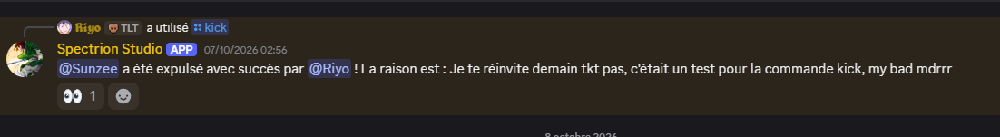

# Spectrion Studio

Le bot sert pour différentes fonctionnalités que ce soit en communautaire ou bien sur la modération.
Il va permettre de pouvoir se reposer sur lui et non sur des bots d'une provenance inconnue ou bien sur les bots utilisés par la grande majorité des owners discord.

Le projet vise à terme à proposer des outils de modération, dont une protection contre les raids.

## Prérequis

- Python 3.10 ou plus récent
- Une application Discord créée sur le [portail développeurs](https://discord.com/developers/applications), avec son bot et son token
- Le Server Members Intent activé (menu Bot → Privileged Gateway Intents), nécessaire pour le message de bienvenue

## Installation

1. Cloner le dépôt :
```bash
   git clone https://github.com/SpectrionStudio/discord-bot.git
   cd discord-bot
```
2. Installer les dépendances :
```bash
   pip install -r requirements.txt
```
3. Copier `.env.example` en `.env` et le remplir avec votre token et l'identifiant de votre serveur.
4. Lancer le bot :
```bash
   python bot.py
```

## Permissions du bot

Pour fonctionner, le bot a besoin des permissions suivantes sur le serveur pour le moment :

- Envoyer des messages et intégrer des liens
- Joindre des fichiers (image de bienvenue)
- Gérer les messages et lire l'historique (commande `/clear`)

Il doit être invité avec les scopes `bot` et `applications.commands`.

## Configuration du serveur

Le message de bienvenue est envoyé dans le **salon des messages système** du serveur (Paramètres du serveur → Général). Sans salon défini, le bot n'envoie rien.

 

## Fonctionnalités

Pour le moment j'ai pu travailler quelques commandes dont : 

- /ping
Ping le bot pour lui parler

- /serveurinfo
Informations sur le serveur

- /userinfo
Information sur l'utilisateur recherché

- /help
Toutes les commandes que je peux exécuter !

- /linktree
Obtenez tous nos réseaux grâce à cette commande !

- /clear
Permet de supprimer un nombre déterminé de messages

Mais aussi des messages de bienvenue pour les nouveaux membres.

## Aperçu


## Technologies

Utilisation principalement de Python ainsi que de discord.py pour le codage de ce bot discord pour le moment.

## Ce que j'ai appris

J'ai pu apprendre différentes choses sur ce codage. Notamment la construction des embed dont je ne connaissais pas du tout le principe. Mais aussi la création de commande que ce soit par évent ou par appel de commande.
Beaucoup de notions que je ne connaissais pas du tout car je n'avais jamais tenté de coder mon propre bot discord dans le passé. Donc beaucoup de choses nouvelles.
Mais aussi des termes que j'ai pu retravailler comme les f string qui ne m'avaient pas manqué.


  > L'illustration de bienvenue n'est pas incluse dans le dépôt : ajoutez votre propre image dans `images/bienvenue.png`.


## Améliorations

Depuis la première version envoyée, j'ai ajouté de la modération et un assistant IA qui tourne en local.

## Modération

Trois commandes de modération, réservées aux personnes qui ont la permission correspondante sur le serveur :

| Commande | Action | Permission requise |
|---|---|---|
| `/kick` | Expulse un membre | Expulser des membres |
| `/ban` | Bannit un membre | Bannir des membres |
| `/timeout` | Exclut temporairement un membre (de 1 minute à 28 jours) | Exclure temporairement des membres |

Chaque commande accepte une raison facultative.

### Sécurité des commandes

Avant d'agir, le bot vérifie :

- que la personne qui lance la commande a la permission requise ;
- que le bot a lui aussi cette permission ;
- qu'on ne vise pas soi-même ;
- que la cible n'a pas un rôle supérieur ou égal à celui du modérateur ;
- que la cible n'a pas un rôle supérieur à celui du bot.

Chaque refus renvoie un message clair, visible uniquement par la personne concernée.

### Message privé

Avant la sanction, le bot envoie un message privé à la personne avec la raison. Si ses messages privés sont fermés, la sanction est appliquée quand même et le modérateur est prévenu que la personne n'a pas pu l'être. Le message est envoyé **avant** l'action, car après un ban ou une expulsion le bot et la personne n'ont plus de serveur en commun.

)
)

### Permissions du bot

En plus de celles de la première version, le bot a besoin de : **Expulser des membres**, **Bannir des membres** et **Exclure temporairement des membres**. Son rôle doit être placé **au-dessus** de ceux des membres qu'il peut sanctionner.

### Ce que j'ai appris

- Les permissions Discord et la hiérarchie des rôles.
- Gérer les cas d'échec : un message privé refusé ne doit pas empêcher la sanction.
- Tester sur un compte secondaire avant d'utiliser une commande sur de vrais membres.



### Assistant IA local : `/ask` et `/lore`

Deux commandes qui discutent avec un modèle de langage qui tourne **sur mon propre PC**, grâce à [Ollama](https://ollama.com). Aucune donnée n'est envoyée à un service en ligne.

- `/ask` : un assistant généraliste, qui se présente comme Spectrion Studio Bot, tutoie, répond en français et avoue quand il ne sait pas.
- `/lore` : un guide de l'univers de *The Release Of Riyo: Second Life*. Il répond uniquement à partir d'un fichier de notes (`lore.txt`) et dit clairement quand une information n'y figure pas, au lieu de l'inventer.

)
)

#### Comment ça marche

```
Discord  →  bot (Python)  →  Ollama (modèle gemma4:12b)  →  bot  →  Discord
```

Le bot ne contient pas d'IA : il envoie la question au modèle et récupère sa réponse. Les deux commandes utilisent le **même modèle** et la **même fonction** (`ia.py`). Seul le *prompt système* change :

- pour `/ask`, il décrit la personnalité du bot ;
- pour `/lore`, il y ajoute le contenu de `lore.txt` avec la consigne de ne répondre qu'à partir de ces notes.

#### Protections

- **Réponse différée** (`defer`) : Discord impose une réponse en 3 secondes, or le modèle peut en demander davantage.
- **Délai de 30 secondes par utilisateur** (cooldown), pour qu'une seule personne ne puisse pas saturer la carte graphique.
- **Question limitée à 500 caractères**.
- **Réponse limitée en longueur** (`num_predict`), puis découpée en morceaux de 2000 caractères maximum si besoin, car c'est la limite d'un message Discord.
- **Mentions désactivées** dans les réponses, pour que le modèle ne puisse pas écrire `@everyone`.
- **Gestion des pannes** : si Ollama est éteint, le bot répond par un message d'excuse au lieu de rester bloqué sur « réfléchit… ».

#### Prérequis supplémentaires

1. Installer [Ollama](https://ollama.com).
2. Télécharger le modèle : `ollama pull gemma4:12b`
3. Créer à côté de `bot.py` un fichier `lore.txt` avec les notes sur l'univers. Il n'est pas inclus dans le dépôt : il est dans le `.gitignore`.

#### Limites

- Le bot ne répond que si mon PC et Ollama sont allumés.
- Le modèle est un modèle ouvert existant (Gemma, de Google) : je ne l'ai pas entraîné. Mon travail porte sur le prompt, la base de connaissances et l'intégration à Discord.
- Un modèle peut se tromper ou interpréter un texte : c'est pourquoi `/lore` est limité aux notes, mais il peut encore reformuler de façon inexacte.


### Ce que ces ajouts m'ont appris

- Gérer des permissions et la hiérarchie des rôles sur un serveur Discord.
- Utiliser une API locale, le rôle d'un prompt système et le fait qu'un modèle n'a pas de mémoire : c'est à moi de lui renvoyer l'historique.
- Déboguer un cas concret : certaines réponses étaient vides parce que le modèle « réfléchissait » et consommait toute la limite de mots avant de répondre. Afficher la réponse brute m'a permis de le voir et de le corriger.
- Programmer en asynchrone (`async` / `await`) pour que le bot ne se bloque pas pendant que le modèle travaille.

